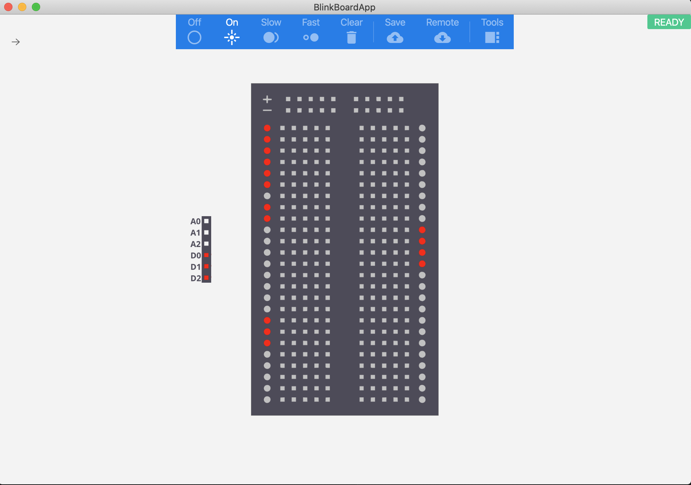

# About BlinkBoard

BlinkBoard is a project from the [MAKinteract](http://makinteract.kaist.ac.kr) lab in the department of [Industrial Design](http://id.kaist.ac.kr) at [KAIST](http://kaist.ac.kr).

It allows an instructor to remotely indicate, via blinking LEDs, in which rows to place components on a physical breadboard. It also allows the instructor to see in real time how the students completed a specific wiring exercise, by reading the voltage level at specific locations of the breadboard.

  

