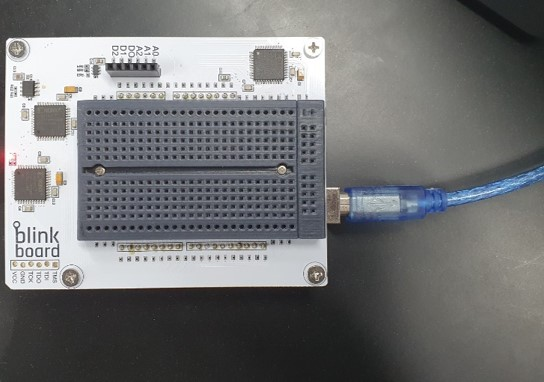
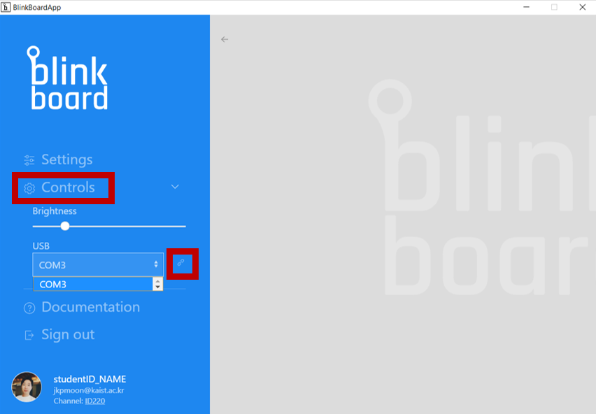
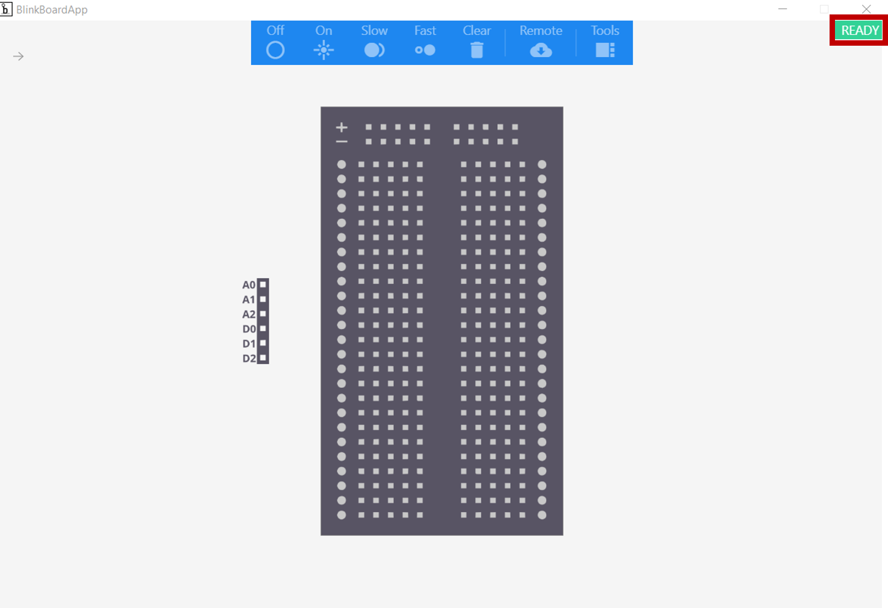

# Connecting via USB

1. Connect your BlinkBoard to your computer using the **USB** **cable** in the kit.

2. Go to **Controls** and select the port name under the USB. Click the button next to the port to connect to the board. When you see the sign **READY** with green background, your BlinkBoard is connected with the application.

