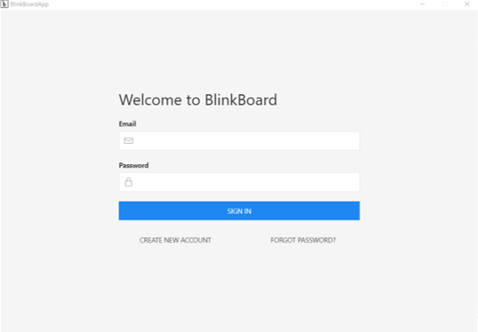
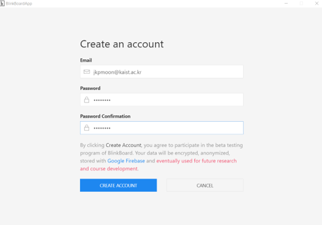
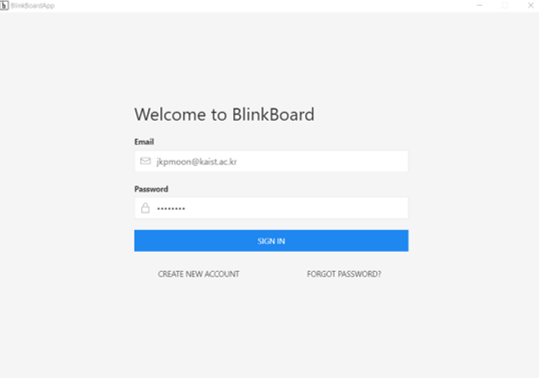
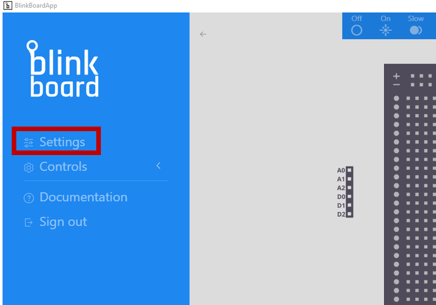
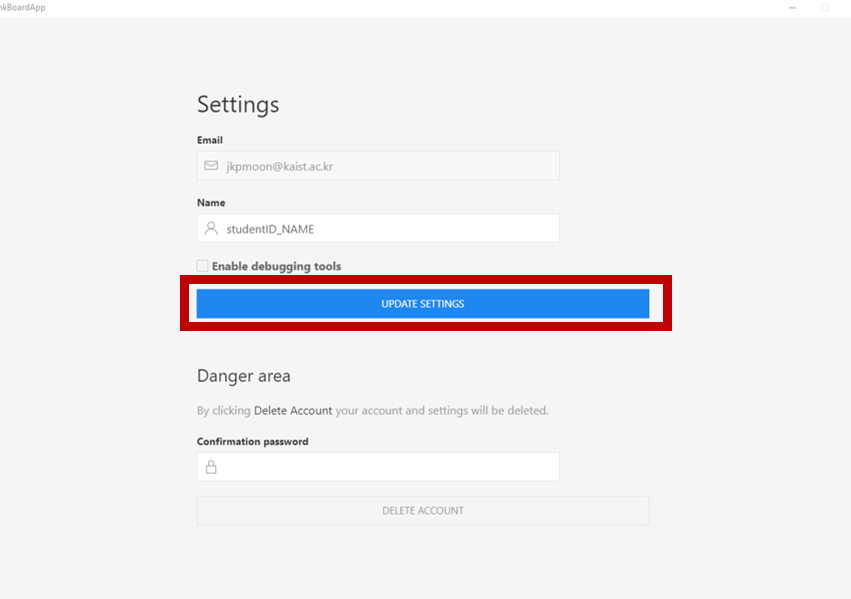

# Creating an account

1. Click **CREATE NEW ACCOUNT**. Type your valid email address and password and click **CREATE ACCOUNT**.

2. Go to your email address and verify your email by clicking the link.   
Reopen the BlinkBoard app and **SIGN IN**.

3.  Go to the Settings, and change the Name to your  \(eg. 11111111\_Justin\) and click **UPDATE SETTING**

