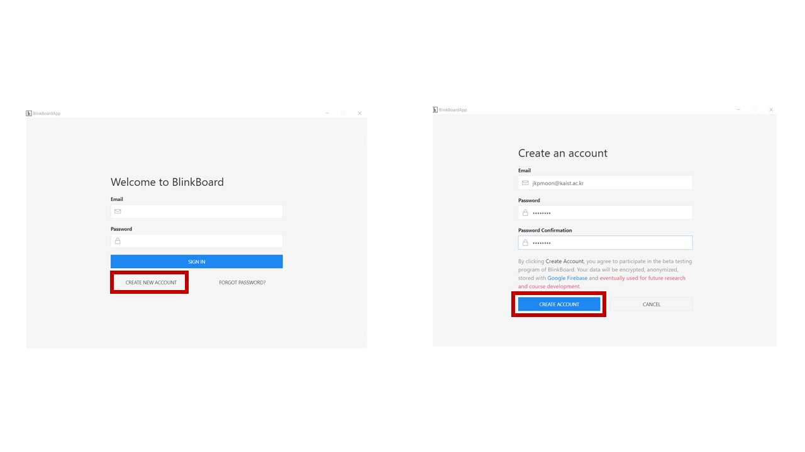
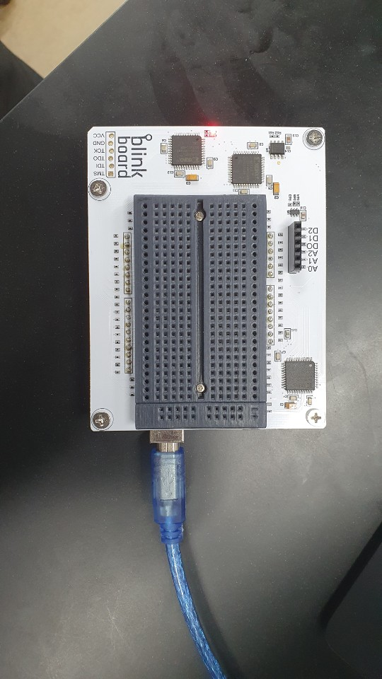

# Creating an account

Create a new account and fill out a valid email address and password.

Check your mailbox, including junk/spam folder, and verify your email address. Reopen the blinkboard app and sign in with your email and password.

Connect your blink board to your computer with the cable in the box\(arduino uno cable\)

Click the top left arrow, and select the port under the Control panel.

Check the top right light. If it is GREEN it is ready to use.

