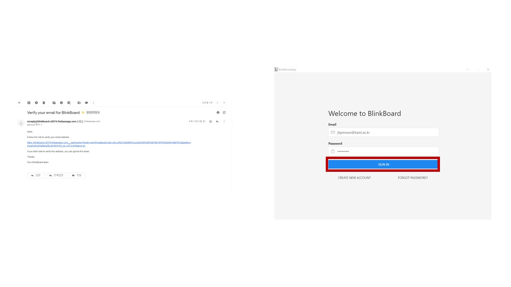
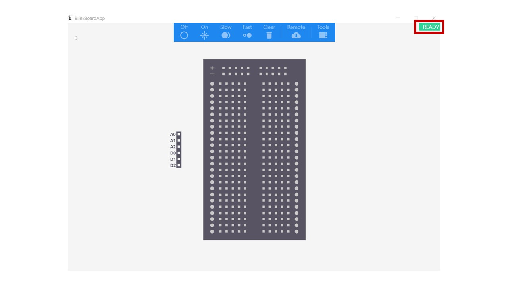

# Creating an account

1. **Create a new account** and fill out a valid email address and password.

2. **Check your mailbox**, including junk/spam folder, and verify your email address. Reopen the BlinkBoard app and **sign in** with your email and password.

3. **Connect** your BlinkBoard to your computer with the **USB** cable in the box.

4. Click the **top left arrow**, and select the port under the Control panel.

5. Check the top right light. If it is **GREEN** it is ready to use.

