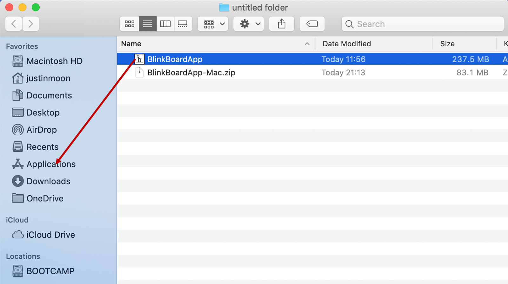

# Installation Mac

1. Download the BlinkBoard app from the official [website](https://blinkboard.kaist.ac.kr/). Extract the downloaded file by double clicking. 

2. Drag the file in Applications. Check your app in Application folder

3. Double click the icon to run the application.

