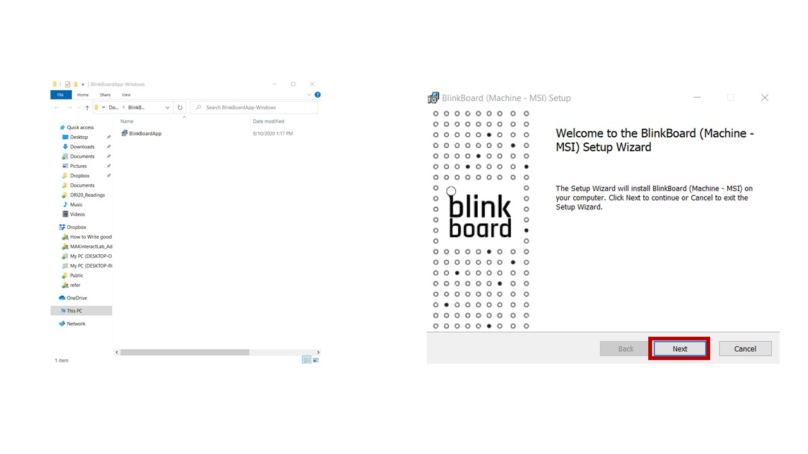
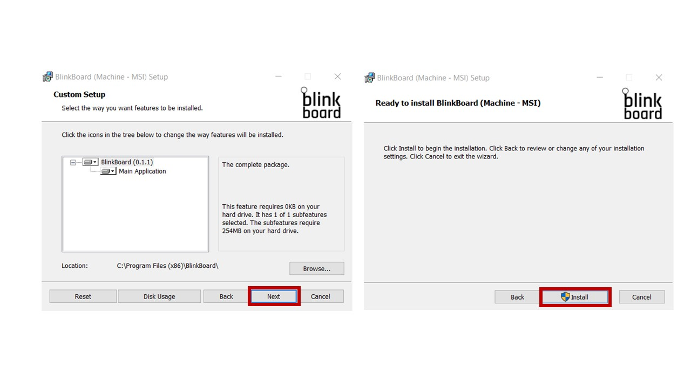
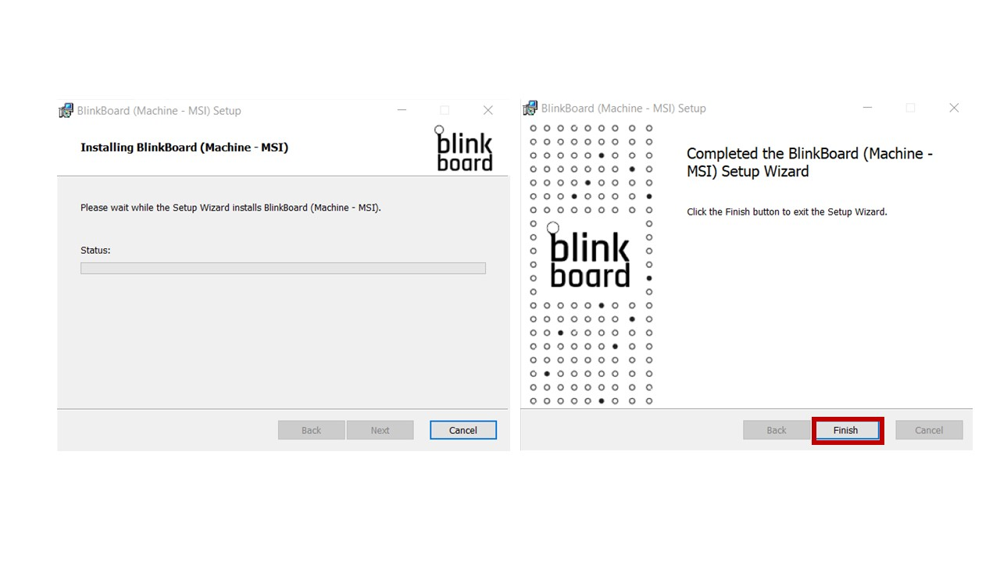

# Installation Windows

1. **Download** the BlinkBoard app from the [official website](http://blinkboard.kaist.ac.kr).
2. **Extract** the downloaded file and double click the installer file. Click **Next** to start proceed

3. Click **Next** for the default \(**recommended**\) setting. Click **install** to start installation

4. Wait for the installation to finish. You may click **Finish** to end the installation

5. Create an [account](creating-an-account.md).

